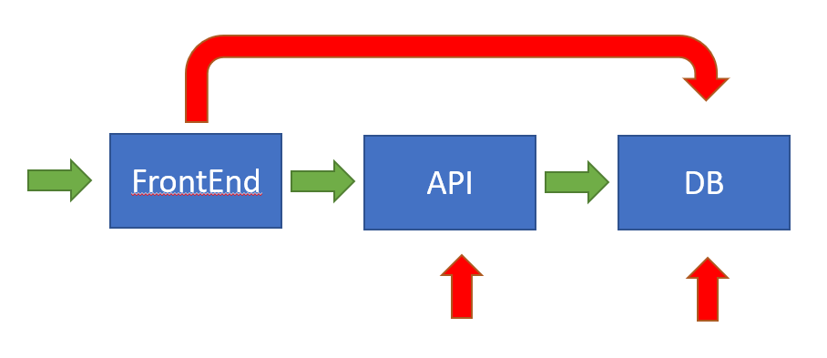

# Kubernets Network Policies

## Problem

Many believe that namespace provides network isolation, but this is not the case. Try this:

```bash
# Create a dev namespace
kubectl create ns dev
# Create a pod and a services
kubectl run nginx --image=nginx:alpine --restart=Never --port=80 --expose -n dev
# Access the service from a differente namespace
k run busybox --image=busybox -it --restart=Never --rm -- /bin/sh -n default
# From inside the pod execute
wget -O- http://nginx.dev
```

The solution is to use Network Policies.

## Description

In this demo, we will create a 3-tier app and setup network policies following the following best practices:

- Deny all traffic by default
- Open all traffic to the frontend only
  - This could be restricted further to a port and protocl
- Open traffic between the fronend and the api and between the api and db, but there should not be traffic from the frontend to the db
  - This could further be restricted by a port and protocl 



## Create a 3-tier app

> **Note:** for testability, we will be using nginx and port 80, but this could be changed to use other ports and applications

```bash
# Create the app deployments
kubectl create deployment frontend --image=nginx:alpine --replicas=3 --port=80
kubectl create deployment api --image=nginx:alpine --replicas=3 --port=80
kubectl create deployment frontend --image=nginx:alpine --replicas=1 --port=80

# Create the app services
kubectl expose deploy frontend --port=80 --target-port=80
kubectl expose deploy api --port=80 --target-port=80
kubectl expose deploy db --port=80 --target-port=80
```

> **Note:** The pods in the deployment automatically get the labels ```app=frontend```, ```app=api```, and ```app=db``` which will be used to filter the traffic.

### Test Connectivity

```
kubectl run busybox --image=busybox --restart=Never --rm -it -- wget -O- http://frontend -T 2 # pass
kubectl run busybox --image=busybox --restart=Never --rm -it -- wget -O- http://api -T 2 # pass
kubectl run busybox --image=busybox --restart=Never --rm -it -- wget -O- http://db -T 2 # pass
```

## Block all traffic to all pods

```yaml
apiVersion: networking.k8s.io/v1
kind: NetworkPolicy
metadata:
  name: denyall
spec:
  podSelector: {}
  policyTypes:
  - Ingress
```

### Test it

```
kubectl run busybox --image=busybox --restart=Never --rm -it -- wget -O- http://frontend -T 2 # fail
kubectl run busybox --image=busybox --restart=Never --rm -it -- wget -O- http://api -T 2 # fail
kubectl run busybox --image=busybox --restart=Never --rm -it -- wget -O- http://db -T 2 # fail
```

## Open all traffic to the frontend pods

```yaml
apiVersion: networking.k8s.io/v1
kind: NetworkPolicy
metadata:
  name: allowtofrontend
spec:
  podSelector:
    matchLabels:
      app : frontend
  ingress:
  - {}
  policyTypes:
  - Ingress
```

### Test it

```
kubectl run busybox --image=busybox --restart=Never --rm -it -- wget -O- http://frontend -T 2 # pass
kubectl run busybox --image=busybox --restart=Never --rm -it -- wget -O- http://api -T 2 # fail
kubectl run busybox --image=busybox --restart=Never --rm -it -- wget -O- http://db -T 2 #fail
```

## Open traffic between the frontend pods and api pods

```yaml
kind: NetworkPolicy
apiVersion: networking.k8s.io/v1
metadata:
  name: allowfrontendtoapi
spec:
  podSelector:
    matchLabels:
      app: api
  ingress:
  - from:
    - podSelector:
        matchLabels:
          app: frontend
```         

### Test it

```
kubectl run busybox --image=busybox --restart=Never --rm -it -- wget -O- http://frontend -T 2 # pass
kubectl run busybox --image=busybox --restart=Never --rm -it -- wget -O- http://api -T 2 # fail
kubectl run busybox --image=busybox --restart=Never --rm -it -- wget -O- http://db -T 2 #fail

## Get a list of running pods
kubect get po

## Execute the commands below replace the FRONTEND-POD and API-POD with actual POD names
kubectl exec <FRONTEND-POD> -it -- curl http://api # pass
kubectl exec <FRONTEND-POD> -it -- curl http://db # fail
kubectl exec <API-POD> -it -- curl http://db # fail
```

## Open all traffic between api pods and the db pods

```yaml
kind: NetworkPolicy
apiVersion: networking.k8s.io/v1
metadata:
  name: allowapitodb
spec:
  podSelector:
    matchLabels:
      app: db
  ingress:
  - from:
    - podSelector:
        matchLabels:
          app: api
```          

### Test it

```
kubectl run busybox --image=busybox --restart=Never --rm -it -- wget -O- http://frontend -T 2 # pass
kubectl run busybox --image=busybox --restart=Never --rm -it -- wget -O- http://api -T 2 # fail
kubectl run busybox --image=busybox --restart=Never --rm -it -- wget -O- http://db -T 2 # fail

## Get a list of running pods
kubect get po

## Execute the commands below replace the FRONTEND-POD and API-POD with actual POD names
kubectl exec <FRONTEND-POD> -it -- curl http://api # pass
kubectl exec <FRONTEND-POD> -it -- curl http://db # fail
kubectl exec <API-POD> -it -- curl http://db # pass
```

## Other Configuration


### Kind cluster with Calico


File: kind.yaml

```yaml
kind: Cluster
apiVersion: kind.x-k8s.io/v1alpha4
nodes:
- role: control-plane
- role: worker
- role: worker
networking:
  disableDefaultCNI: true
  podSubnet: 192.168.0.0/16
```

```bash
kind create cluster --config=config.yml

# Install Calico
kubectl apply -f https://docs.projectcalico.org/v3.8/manifests/calico.yaml

# Configure Calico for development
kubectl -n kube-system set env daemonset/calico-node FELIX_IGNORELOOSERPF=true
```

## References

- [Kind Cluster with Calico](https://alexbrand.dev/post/creating-a-kind-cluster-with-calico-networking/)
